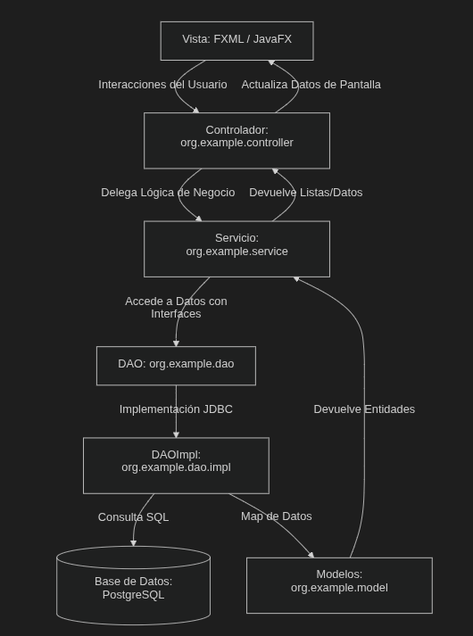

# MEMORIA TÉCNICA: SISTEMA DE GESTIÓN DE INVENTARIO DE OFICINAS Y MATERIALES

---

## 1. DESCRIPCIÓN DE LA TEMÁTICA ELEGIDA

El proyecto **Gestión de Inventario de Oficinas y Materiales** es una aplicación de escritorio diseñada para centralizar, controlar y auditar el ciclo de vida de los recursos materiales e informáticos (ordenadores, periféricos, mobiliario) distribuidos en las delegaciones de una organización.

El sistema resuelve el descontrol logístico habitual en la asignación física de hardware corporativo, proporcionando una base de datos transaccional integrada con una interfaz gráfica interactiva que asegura la trazabilidad en tiempo real.

El núcleo del sistema gestiona de manera unificada tres pilares fundamentales:

### A. Recursos Humanos (Usuarios/Técnicos)
Operadores del sistema con responsabilidad para registrar altas, modificaciones y traslados. El acceso se restringe mediante una pantalla de inicio de sesión (*login*), asegurando que solo el personal activo e identificado pueda modificar los registros, garantizando la auditoría de cada acción.

### B. Recursos Geográficos (Oficinas/Sedes)
Delegaciones físicas de la empresa (ej. Madrid, Valencia, Salamanca) que actúan como contenedores de activos. El sistema permite monitorizar la asignación de hardware por sede a tiempo real para optimizar compras y reubicar excedentes, soportando una fuerte integridad referencial.

### C. Recursos Materiales (Materiales/Activos)
Equipos informáticos y mobiliario corporativo de la empresa. Cada activo posee campos estáticos (tipo, marca, modelo, descripción, fecha de alta) y un estado de ciclo de vida variable (`ALTA`, `ROTO`, `REPARACION` o `BAJA`), crítico para la planificación técnica y de compras.

### D. Submódulo de Historial y Auditoría
Registro inmutable de transacciones que graba de forma perpetua cada traslado o cambio de estado, indicando el técnico responsable, la fecha exacta y las observaciones de la operación. Actúa como bitácora de auditoría y previene la pérdida no justificada de activos.

---

## 2. JUSTIFICACIÓN DEL PROYECTO

La pérdida de control de hardware corporativo y el uso de hojas de cálculo propensas a errores de concurrencia y erratas motivan el desarrollo de este software. La aplicación ofrece una alternativa ágil y robusta ante las complejas y costosas soluciones comerciales.

Razones clave que justifican el proyecto:
1. **Optimización Operativa**: Reemplaza procesos manuales por una interfaz interactiva con validaciones en tiempo de ejecución, reduciendo errores humanos.
2. **Seguridad y Auditoría Estricta**: La base de datos y sus restricciones relacionales imposibilitan registros huérfanos o la desaparición injustificada de activos.
3. **Bajo Coste e Independencia**: Basado en tecnologías de código abierto (Java 21, JavaFX, PostgreSQL), libre de licencias comerciales.
4. **Consolidación Didáctica**: Demuestra el dominio práctico de la POO (herencia, polimorfismo, excepciones) y de patrones empresariales en el desarrollo de software.

---

## 3. EXPLICACIÓN DE LA ARQUITECTURA MVC APLICADA

Se ha implementado una arquitectura multicapa basada en el patrón **Modelo-Vista-Controlador (MVC)**, enriquecido con la capa de **Servicio** y el patrón **DAO (Data Access Object)**, aislando la lógica de negocio de la interfaz gráfica y de la persistencia de datos.

La separación de responsabilidades se divide en las siguientes capas:



### Capas del Sistema

1. **La Vista (View)**: Diseños declarativos en archivos **FXML** (`src/main/resources/view/`) que estructuran tablas dinámicas (`TableView`) y formularios interactivos reactivos con estilos CSS aplicados.
2. **El Controlador (Controller)**: Clases en `org.example.controller` que capturan eventos del usuario (clicks, selección de filas) y actualizan de forma dinámica las vistas utilizando inyecciones `@FXML`.
3. **La Capa de Servicio (Service)**: Ubicada en `org.example.service` para alojar la lógica de negocio y las validaciones previas (ej. verificación de login y estado del usuario) antes de invocar la capa de datos.
4. **El Modelo (Model)**: Objetos estructurados (POJOs) en `org.example.model` con encapsulamiento y tipos enumerados para representar fielmente las entidades relacionales.
5. **Capa DAO (Data Access Object)**:
    * **Interfaces (`org.example.dao`)**: Definen el contrato estricto de las operaciones CRUD, aislando la lógica gráfica del almacenamiento físico.
    * **Implementaciones (`org.example.dao.impl`)**: Contienen el código tecnológico de **JDBC** para interactuar con PostgreSQL mediante sentencias SQL preparadas y mapear resultados.
6. **Configuración (`org.example.config`)**: Contiene la clase `ConexionBD` que gestiona de manera centralizada la conexión a PostgreSQL con el driver oficial JDBC.

---

## 4. DESCRIPCIÓN DE LA BASE DE DATOS Y SU ESTRUCTURA

El soporte de persistencia reside en el RDBMS **PostgreSQL**, garantizando la robustez mediante restricciones de integridad referencial y enumerados nativos.

### A. Estructura Relacional (Tablas y Vistas)

La base de datos consta de 4 tablas físicas y una vista unificada para consultas ágiles:

1. **USUARIOS**: Técnicos autorizados del sistema.
    * `ID_USUARIO` (SERIAL PK): Identificador único autoincremental.
    * `NOMBRE` (VARCHAR, NOT NULL): Nombre del técnico.
    * `EMAIL` (VARCHAR UNIQUE, NOT NULL): Correo de acceso.
    * `PASSWORD` (VARCHAR, NOT NULL): Contraseña.
    * `ESTADO` (ESTADO_GENERAL: ENUM 'ALTA', 'BAJA'): Flag operativo.
    * `FECHA_ALTA` (DATE DEFAULT CURRENT_DATE).
2. **OFICINAS**: Sedes físicas registradas.
    * `ID_OFICINA` (SERIAL PK): Identificador de oficina.
    * `NOMBRE` (VARCHAR, NOT NULL): Nombre de la delegación.
    * `ESTADO` (ESTADO_GENERAL): Estado lógico.
    * `FECHA_ALTA` (DATE DEFAULT CURRENT_DATE).
3. **MATERIALES**: Bienes tangibles del inventario.
    * `ID_MATERIAL` (SERIAL PK): Identificador único del activo.
    * `TIPO`, `MARCA`, `MODELO` (VARCHAR, NOT NULL).
    * `DESCRIPCION` (VARCHAR): Descripción libre.
    * `ESTADO` (ESTADO_MATERIAL: ENUM 'ALTA', 'BAJA', 'ROTO', 'REPARACION').
    * `FECHA_ALTA` (DATE DEFAULT CURRENT_DATE).
    * `ID_OFICINA` (INT FK): Sede donde está asignado actualmente.
4. **HISTORIAL_MATERIALES**: Registro de auditoría perpetuo.
    * `ID_HISTORIAL` (SERIAL PK).
    * `FECHA` (DATE DEFAULT CURRENT_DATE).
    * `ID_MATERIAL` (INT FK), `ID_OFICINA` (INT FK), `ID_USUARIO` (INT FK).
    * `ESTADO` (ESTADO_MATERIAL): Estado del material tras la operación.
    * `OBSERVACION` (VARCHAR): Justificación del cambio.
5. **VISTA_HISTORIAL**: Vista SQL que precalcula los `JOIN` relacionales entre el historial, materiales, oficinas y usuarios, optimizando el consumo del servidor y acelerando las lecturas en la aplicación.

```sql
CREATE VIEW VISTA_HISTORIAL AS
SELECT
    H.ID_HISTORIAL AS ID,
    H.FECHA,
    H.ESTADO,
    M.TIPO,
    M.MARCA,
    M.MODELO,
    O.NOMBRE AS OFICINA,
    U.NOMBRE AS USUARIO,
    H.OBSERVACION
    FROM HISTORIAL_MATERIALES H
    JOIN MATERIALES M ON H.ID_MATERIAL = M.ID_MATERIAL
    JOIN OFICINAS O ON H.ID_OFICINA = O.ID_OFICINA
    JOIN USUARIOS U ON H.ID_USUARIO = U.ID_USUARIO;
```

### B. Diagrama de Relación de la Base de Datos

```
 +------------------+           +------------------+
 |     OFICINAS     |           |     USUARIOS     |
 +------------------+           +------------------+
 | PK | id_oficina  |<---+      | PK | id_usuario  |<---+
 |    | nombre      |    |      |    | nombre      |    |
 |    | estado      |    |      |    | email       |    |
 |    | fecha_alta  |    |      |    | password    |    |
 +------------------+    |      |    | estado      |    |
          | 1            |      |    | fecha_alta  |    |
          |              |      +------------------+    |
          | 1..N         |               | 1            |
 +------------------+    |               |              |
 |    MATERIALES    |    |               | 1..N         |
 +------------------+    |      +-----------------------+
 | PK | id_material |<---+------|  HISTORIAL_MATERIALES |
 +------------------+    |      +-----------------------+
 |    | tipo        |    |      | PK | id_historial     |
 |    | marca       |    +------| FK | id_material      |
 |    | modelo      |           | FK | id_oficina       |
 |    | descripcion |           | FK | id_usuario       |
 |    | estado      |           |    | fecha            |
 |    | fecha_alta  |           |    | estado           |
 | FK | id_oficina  |           |    | observacion      |
 +------------------+           +-----------------------+
```

---

## 5. EXPLICACIÓN DEL FUNCIONAMIENTO DEL CÓDIGO (PARTES CLAVE)

### A. Gestión de Conexiones JDBC con Manejo de Recursos
Uso de la clase `ConexionBD` centralizada. Se aplica la sentencia `try-with-resources` para garantizar la liberación automática de conexiones, sentencias y resultados, evitando fugas de memoria o bloqueos.

**Clase `ConexionBD.java`:**
```java
package org.example.config;

import org.example.exception.DatosException;
import java.sql.Connection;
import java.sql.DriverManager;
import java.sql.SQLException;

public class ConexionBD {
    private static final String URL = "jdbc:postgresql://localhost:5432/inventario";
    private static final String USUARIO = "postgres";
    private static final String CONTRASENA = "postgres";

    public static Connection obtenerConexion() throws DatosException {
        try {
            return DriverManager.getConnection(URL, USUARIO, CONTRASENA);
        } catch (SQLException error) {
            throw new DatosException("Error al conectar con la base de datos: " + error.getMessage());
        }
    }
}
```

### B. Mapeo Seguro de Datos y Consultas Parametrizadas
Prevención de **Inyección de SQL** mediante el uso estricto de `PreparedStatement`. Se encapsula el mapeo de registros relacionales a objetos Java en métodos auxiliares compartidos.

**Método `crearNuevoUsuario` (`UsuarioDAOImpl.java`):**
```java
@Override
public void crearNuevoUsuario(Usuario nuevoUsuario) throws DatosException {
    String sql = "INSERT INTO usuarios (nombre, email, password, estado) VALUES (?, ?, ?, ?::estado_general)";
    try (Connection conexion = ConexionBD.obtenerConexion();
         PreparedStatement consulta = conexion.prepareStatement(sql, Statement.RETURN_GENERATED_KEYS)) {
        
        consulta.setString(1, nuevoUsuario.getNombreUsuario());
        consulta.setString(2, nuevoUsuario.getCorreoElectronico());
        consulta.setString(3, nuevoUsuario.getContrasena());
        consulta.setString(4, nuevoUsuario.getEstado().name());

        consulta.executeUpdate();

        try (ResultSet resultadoId = consulta.getGeneratedKeys()) {
            if (resultadoId.next()) {
                nuevoUsuario.setIdUsuario(resultadoId.getInt(1));
            }
        }
    } catch (SQLException e) {
        throw new DatosException("Ha fallado al guardar el usuario en la base de datos: " + e.getMessage());
    }
}
```

### C. Lógica de Negocio y Validación en la Capa de Servicios
La capa `service` actúa como filtro de validación de negocio antes de la persistencia de datos (ej. comprobar datos obligatorios, validar contraseñas y verificar el estado activo).

**Método `comprobarLogin` (`UsuariosService.java`):**
```java
public Usuario comprobarLogin(String correo, String clave) throws DatosException {
    if (correo == null || correo.isEmpty() || clave == null || clave.isEmpty()) {
        throw new DatosException("El correo o la contraseña no pueden estar vacíos");
    }
    Usuario usuarioEncontrado = buscarPorCorreo(correo);
    if (usuarioEncontrado == null) {
        throw new DatosException("El correo o la contraseña son incorrectos");
    }
    if (!usuarioEncontrado.getContrasena().equals(clave)) {
        throw new DatosException("El correo o la contraseña son incorrectos");
    }
    if (usuarioEncontrado.getEstado() != EstadoGeneral.ALTA) {
        throw new DatosException("Ese usuario está dado de baja, no puede entrar");
    }
    return usuarioEncontrado;
}
```

### D. Implementación Técnica del Borrado Lógico (Soft Delete)
Para conservar el histórico relacional de transacciones, los métodos DAO ejecutan actualizaciones (`UPDATE`) de estado a `'BAJA'` en lugar de sentencias físicas `DELETE`.

**Método `eliminarUsuario` (`UsuarioDAOImpl.java`):**
```java
@Override
public void eliminarUsuario(int idDelUsuario) throws DatosException {
    String sql = "UPDATE usuarios SET estado = 'BAJA'::estado_general WHERE id_usuario = ?";
    try (Connection conexion = ConexionBD.obtenerConexion();
         PreparedStatement consulta = conexion.prepareStatement(sql)) {
        
        consulta.setInt(1, idDelUsuario);
        consulta.executeUpdate();
    } catch (SQLException e) {
        throw new DatosException("Error al dar de baja al usuario: " + e.getMessage());
    }
}
```

---

## 6. PROBLEMAS ENCONTRADOS Y SOLUCIONES APLICADAS

### Problema 1: Incompatibilidad de Tipos ENUM en PostgreSQL
* **Descripción**: Excepciones de tipado al enviar strings desde JDBC a columnas PostgreSQL con tipos enumerados nativos (`estado_general`/`estado_material`).
* **Solución**: Se añadió casting directo a las consultas preparadas en SQL (`?::estado_general` y `?::estado_material`) para forzar la conversión interna del driver JDBC.

### Problema 2: Violación de Restricciones por Borrados en Cascada
* **Descripción**: Errores relacionales graves al eliminar físicamente registros con histórico de movimientos previos en la tabla `HISTORIAL_MATERIALES`.
* **Solución**: Reemplazo de sentencias `DELETE` por una estrategia uniforme de **Borrado Lógico**, cambiando el valor del campo `estado` a `'BAJA'` para conservar la integridad referencial.

### Problema 3: Duplicación en Mapeo Relacional de ResultSets
* **Descripción**: Redundancia extrema de código al transformar cada fila relacional (`ResultSet`) en objetos Java en los distintos métodos de consulta del DAO.
* **Solución**: Creación de métodos de mapeo auxiliares reutilizables (`mapResultSetToUsuario`, etc.), centralizando y limpiando la lógica de conversión.

### Problema 4: Conflicto Relacional al Registrar Correos Existentes Dados de Baja
* **Descripción**: Violación de clave única (`UNIQUE` en correo) si un técnico dado de baja lógicamente (`'BAJA'`) intentaba ser registrado nuevamente como una inserción nueva.
* **Solución**: La capa de servicio intercepta el registro. Si detecta el correo en estado `'BAJA'`, ejecuta una reactivación automática transparente modificando el estado de vuelta a `'ALTA'` y actualizando sus credenciales con un `UPDATE`.

---

## 7. CONCLUSIÓN

La aplicación integra con éxito una separación nítida de responsabilidades (MVC/DAO/Services), una interfaz de usuario interactiva y fluida en JavaFX, y una base relacional robusta.

Vías de mejora futuras:
1. **Seguridad Criptográfica**: Cifrar contraseñas con algoritmos seguros como BCrypt antes de guardarlas en PostgreSQL.
2. **Exportación de Informes**: Implementación de reportes PDF (iText) o Excel (Apache POI) del inventario y traslados.
3. **Servicio Web REST**: Desacoplar la base de datos construyendo una API REST intermedia que permita soporte a clientes concurrentes móviles o web.
